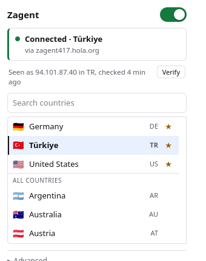
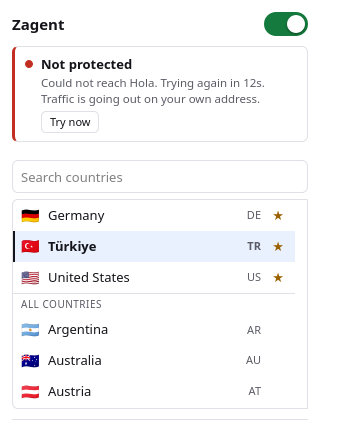

# Zagent

Give Firefox an IP address in one of 47 countries, using Hola's proxy network,
without becoming an exit node for anybody else.

No daemon, no bundled binary, no build step. It reimplements the handshake from
[hola-proxy](https://github.com/snawoot-proxies-forks/hola-proxy) in JavaScript
and hands the result to Firefox's `proxy.onRequest`, so Firefox talks to the
proxies itself.

| Working | Tunnel down, fail-closed off |
| --- | --- |
|  |  |

Same green switch. Opposite truth. That distinction is most of the design.

> Not affiliated with Hola. It uses their public client API the way their own
> extension does.

## Read this before you install it

**Your destinations are visible to Hola.** Every request goes out as a
`CONNECT host:443` through their agent, so they see which sites you visit and
how much traffic, though not the contents of HTTPS pages. Hola's historical
business was selling access to its users' connections. Decide whether that
trade is one you want before, not after.

**It is not a VPN.** Nothing outside Firefox is protected. Turning it on clears
no cookies and changes no fingerprint, so sites that knew you still do.

**What it will not do to you:** on the default Datacenter setting, nobody else's
traffic ever exits through your connection. That is the part of Hola's model
worth declining, and it is off unless you go and turn it on.

## Install

Download the XPI from the [latest release](https://github.com/enojbes/zagent/releases/latest)
and open it in Firefox. It is signed by Mozilla, installs permanently, and
updates itself from then on.

Then, once:

- **Allow it in private windows.** `about:addons` → Zagent → *Run in Private
  Windows* → *Allow*. Firefox otherwise skips extensions there, so private tabs
  would quietly use your real address. The panel warns you in red if you have
  not done this.
- **Pick a country.** There is no default. The switch stays disabled until you
  choose.

To run from source instead: `about:debugging#/runtime/this-firefox` → *Load
Temporary Add-on* → `src/manifest.json`. It works at once and vanishes on
restart.

## Choosing an exit

Five options, and the first is the answer unless you have a specific reason.

| Exit | Comes out at | Trade |
| --- | --- | --- |
| **Datacenter** | Hola's own servers | Fastest. Streaming services and banks often reject it |
| Datacenter pool | A shared pool of the same | Same trade, different addresses |
| Residential | A home line rented from Bright Data | Harder to block, slower, and it is a stranger's line |
| Peer | Another Hola user's home connection | Harder to block, slowest, meant to run both ways |
| Virtual pool | A pool Hola fills for a couple of countries | Fails almost everywhere else |

Only **Datacenter** has been measured here: `country=tr` came out at
`94.101.87.40`, AS42926 Radore, Istanbul. `hola-proxy` documents only Datacenter
and Residential; the other three are undocumented code paths, and its source
comment on Virtual pool says "seems to be for brazil and japan only". The panel
groups them accordingly and says which is which. To measure them yourself,
`node tools/probe-types.mjs tr`.

Two limits worth knowing regardless of choice. Hola blocks about 195 domains at
the proxy, mostly webmail, so those simply fail while the tunnel is up; add them
to the bypass list. And exiting through Turkey means inheriting Turkish ISP
blocks. It is a Turkish address, not a freer one.

## What the panel is telling you

The switch shows what you asked for. The block underneath shows what is
happening to your traffic. They diverge exactly when it matters.

| | |
| --- | --- |
| **Off** | Traffic is going out on your own address |
| **Connecting** | Traffic is held until the tunnel is up |
| **Connected** | Country, and the agent carrying it |
| **Connected**, amber | Working, but Hola could not be reached to refresh it |
| **Traffic blocked** | Fail-closed is on and there is no tunnel. Requests fail |
| **Not protected** | Fail-closed is off and there is no tunnel. You are exposed |

*Try now* appears only when a retry could help, and stays hidden during a Hola
block, because retrying through a block is what causes blocks.

*Verify* asks ipinfo.io what address it sees, and forgets the answer as soon as
the agent chain changes so it cannot go stale. It is the only thing here that
contacts a third party, and only when you press it.

**Clicking a country connects to it.** If the tunnel is off it comes on; if it
is already up elsewhere it moves. A click that only changed a setting and waited
for you to find the switch was a click that appeared to do nothing.

Pin countries with the star to keep them at the top. Pins are yours to set, not
inferred from what you happened to use last. They step aside while you are
searching, since a match buried under pins is worse than plain alphabetical
order.

The panel does not grab focus when it opens; typing anywhere filters. Arrows
move, Enter picks, Escape clears.

## Settings

**Block traffic when no tunnel is up.** On by default. Gecko falls back to the
browser's own proxy setting once it runs off the end of a failover chain, which
for most people means the real connection. Ending the chain with `null` stops
that, so a request fails instead of quietly leaking.

**Stop WebRTC from leaking your IP.** WebRTC opens UDP sockets that never touch
an HTTP proxy. Without this, a video call or a fingerprinting script sees your
real address.

**Disable DNS prefetch and speculative connections.** Proxied requests resolve
names at the agent and leak nothing. Prefetch resolves them locally in advance,
where your ISP sees them.

**Never tunnel these hosts.** One per line; an entry covers its subdomains.
Loopback, RFC 1918 and link-local always skip the tunnel and are not part of
this list.

## Under the hood

Roughly 1,350 lines, 12 shipped files, no dependencies. The per-request decision
costs 237ns and allocates nothing.

[docs/internals.md](docs/internals.md) covers the Hola handshake, the hot path,
how fail-closed actually works in Gecko, why this is Manifest V2, and why Hola
will block your address if you click around too fast.

[docs/development.md](docs/development.md) covers the test suite, the two
browser harnesses, and cutting a release.

## Licence

MIT, see [LICENSE](LICENSE). The protocol work is
[Snawoot](https://github.com/Snawoot)'s and is credited in [NOTICE](NOTICE); the
original repository is gone from GitHub and this was ported from the
[reconstruction](https://github.com/snawoot-proxies-forks/hola-proxy).
